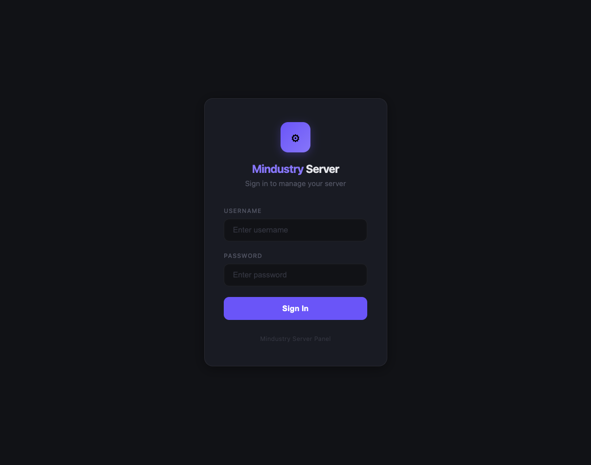
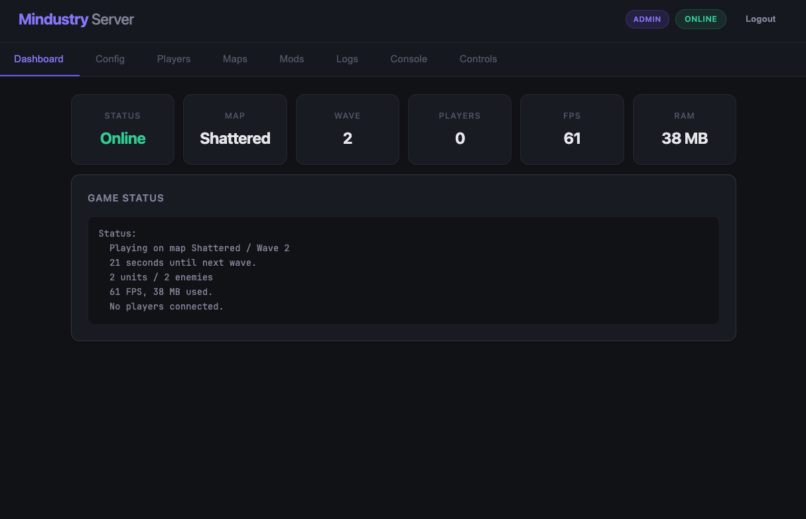
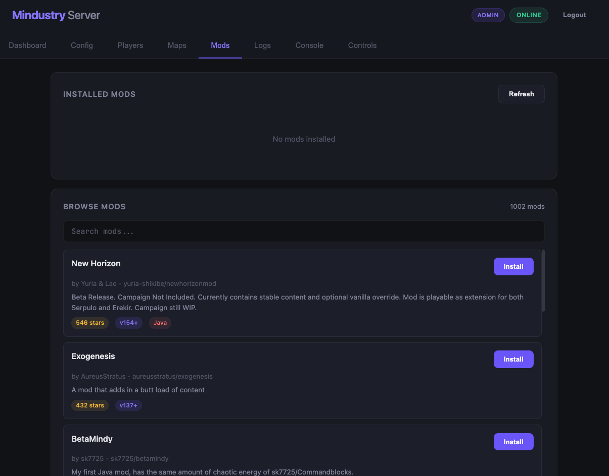
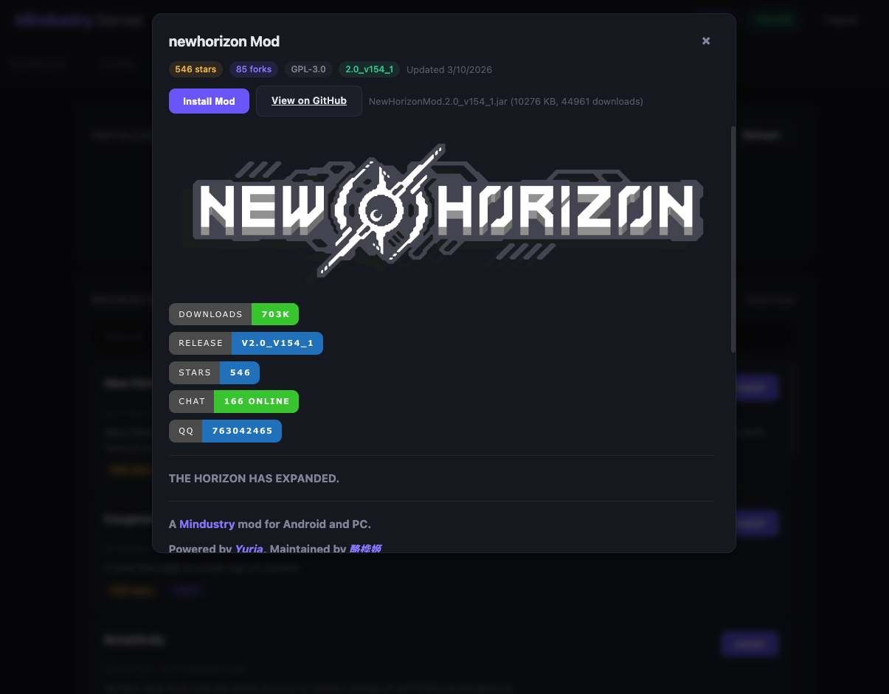
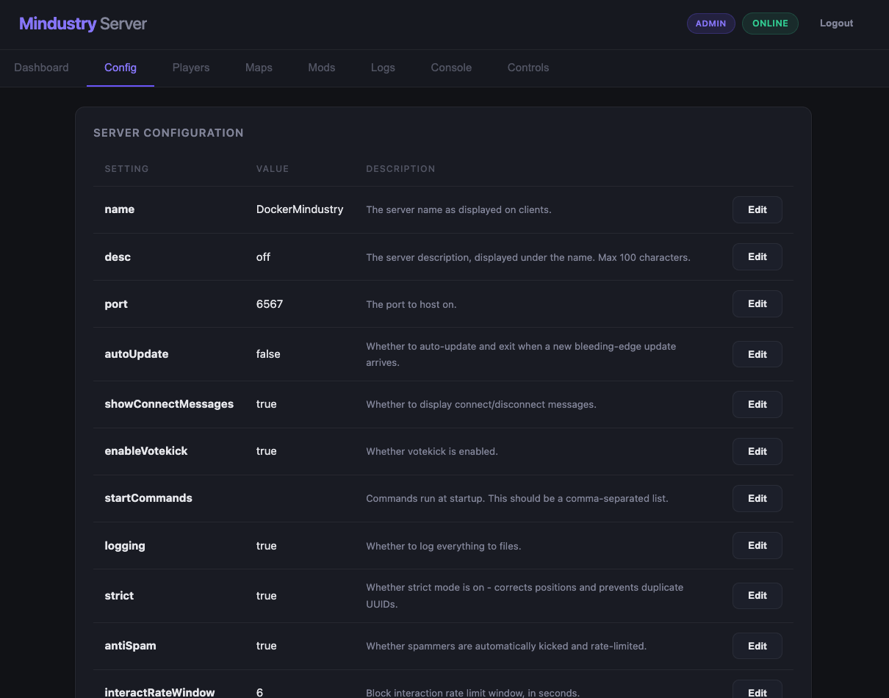
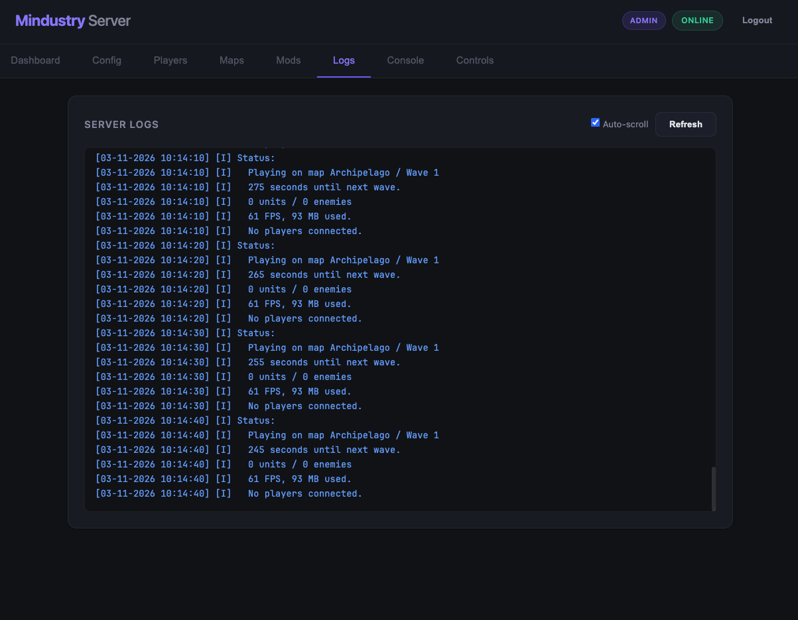
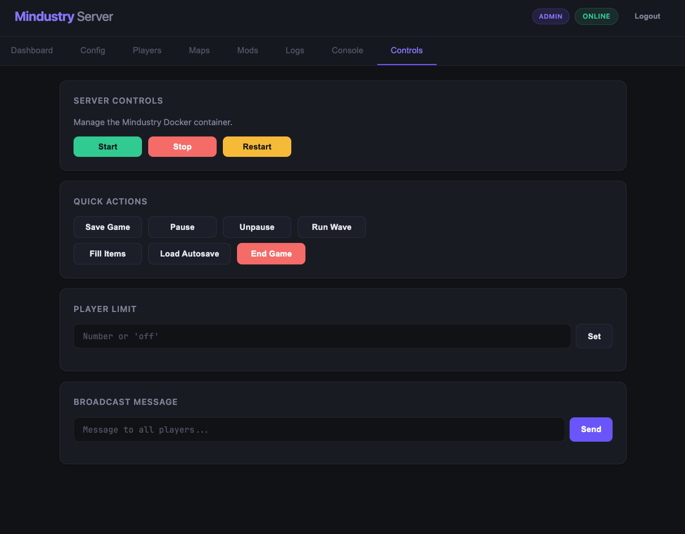

# Mindustry Server

A self-hosted Mindustry game server with a web-based admin panel. Run both the game server and management UI with a single `docker compose up`.

## Features

### Game Server
- [Mindustry](https://mindustrygame.github.io/) dedicated server via Docker
- Configurable game version
- Persistent data (saves, maps, mods, settings)

### Admin Panel
- **Dashboard** - Live server status, map, wave, players, FPS, RAM
- **Config Editor** - View and edit all server settings
- **Player Management** - Kick, ban, unban, admin, search, info
- **Map Manager** - Browse maps, host with mode selection, set next map
- **Mod Manager** - Browse 1600+ mods from GitHub, install/uninstall with one click, view mod details and README
- **Server Logs** - Real-time log viewer with color coding
- **Console** - Direct server console access
- **Controls** - Start/stop/restart container, quick actions, broadcast messages
- **Role-based Access** - Admin, Mod, and Viewer roles with granular permissions
- **PWA Support** - Installable on mobile devices
- **Responsive UI** - Clean dark theme, works on desktop and mobile
- **Offline Handling** - Graceful UI when server is stopped

## Screenshots

| Login | Dashboard |
|-------|-----------|
|  |  |

| Mods Browser | Mod Detail |
|--------------|------------|
|  |  |

| Config | Logs |
|--------|------|
|  |  |

| Controls |  |
|----------|--|
|  | |

## Quick Start

### Prerequisites
- [Docker](https://docs.docker.com/get-docker/) and Docker Compose

### Setup

1. Clone the repository:
   ```bash
   git clone https://github.com/yourusername/mindustry-server.git
   cd mindustry-server
   ```

2. Create your environment file:
   ```bash
   cp .env.example .env
   ```

3. Edit `.env` with your settings:
   ```env
   GAME_V=155
   USERS=admin:yourpassword:admin
   ADMIN_PORT=9125
   ```

4. Start the server:
   ```bash
   docker compose up -d
   ```

5. Access the admin panel at `http://localhost:9125`

6. Connect to the game server at `localhost:6567`

## Configuration

### Environment Variables

| Variable | Default | Description |
|----------|---------|-------------|
| `GAME_V` | `155` | Mindustry game version (number only, no "v" prefix) |
| `USERS` | `admin:changeme:admin` | Admin panel users (see format below) |
| `CONTAINER_NAME` | `mindustry-server` | Docker container name for the game server |
| `LOG_PATH` | `/logs/log-0.txt` | Log file path inside the admin container |
| `ADMIN_PORT` | `9125` | Host port for the admin panel |

### User Format

Users are defined in the `USERS` environment variable:

```
user1:password1:role1,user2:password2:role2
```

**Roles:**
| Role | Description |
|------|-------------|
| `admin` | Full access - config editing, container control, mod management, player admin |
| `mod` | Moderate access - kick/ban players, host maps, console, broadcast |
| `viewer` | Read-only access - view dashboard, logs, player list |

### Exposing to the Internet

To expose the game server publicly, you need to forward port `6567` (TCP + UDP) to your host. For the admin panel, set up a reverse proxy (e.g., Nginx) with SSL.

## Project Structure

```
mindustry-server/
├── docker-compose.yml    # Service orchestration
├── .env.example          # Environment template
├── admin/                # Admin panel (Node.js)
│   ├── Dockerfile
│   ├── server.js         # Express API server
│   ├── package.json
│   └── public/           # Frontend SPA
│       ├── index.html
│       ├── app.js
│       ├── style.css
│       └── ...
└── data/                 # Server runtime data (gitignored)
    └── config/
        ├── mods/         # Installed mods
        ├── maps/         # Custom maps
        └── logs/         # Server logs
```

## Admin Panel Roles

| Feature | Admin | Mod | Viewer |
|---------|-------|-----|--------|
| View dashboard & logs | Yes | Yes | Yes |
| View config & player list | Yes | Yes | Yes |
| Edit config | Yes | No | No |
| Kick/ban players | Yes | Yes | No |
| Manage player admins | Yes | No | No |
| Host maps | Yes | Yes | No |
| Install/remove mods | Yes | No | No |
| Server console | Yes | Yes | No |
| Start/stop/restart server | Yes | No | No |
| Broadcast messages | Yes | Yes | No |

## Tech Stack

- **Game Server**: [ich777/mindustry-server](https://hub.docker.com/r/ich777/mindustry-server) Docker image
- **Admin Panel**: Node.js, Express, Dockerode
- **Frontend**: Vanilla HTML/CSS/JS (no framework, no build step)

## License

MIT
